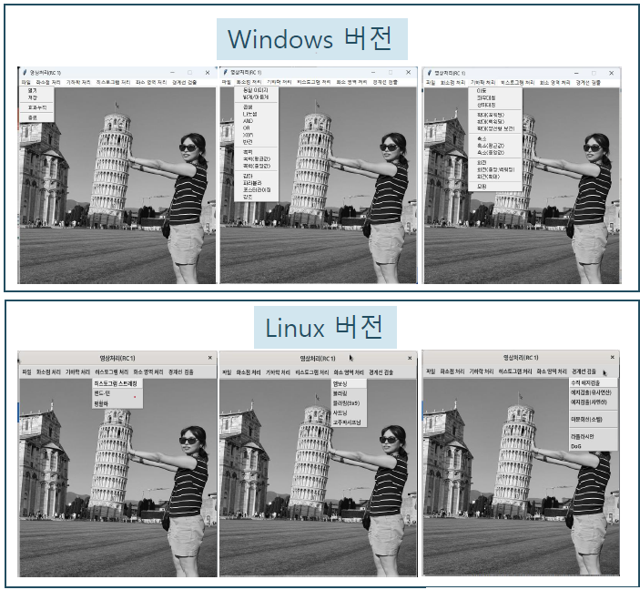

# GrayScale Image Processing 
- Python version

## Purpose
- Open CV 없이 Python으로 구현한 GrayScale Image Processing  
  (C언어 버전 포팅)
  

## Development Environment
- Windows 11, Rocky9  
- PyCharm 2023.3.4, Python

## Function
- 파일 : 열기, 저장 , 효과 누적
- 화소점 처리  
  기하학 처리  
  히스토그램 처리  
  화소 영역 처리 
  경계선 검출  

  

